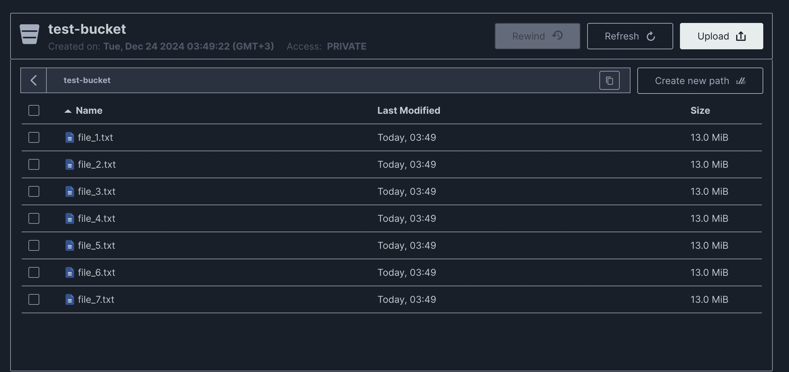

# Хранилище S3 с MiniO и Авто-Загрузчиком

## Требования
- Установленные Docker и Docker Compose

## Установка
1. Клонируйте репозиторий:
    ```bash
    git clone <url-репозитория>
    cd <папка-репозитория>

2. Запустите проект:
    ```bash
    docker-compose up --build
    ```

3. Откройте веб-интерфейс MiniO по адресу `http://localhost:9000` или `http://localhost:9001`(в любом случае будет перенаправление), войдите, используя `your_access_key` и `your_secret_key`

4. Наблюдайте за логами загрузчика в консоли.

## Примечания
- Использование дискового пространства ограничено 100 МБ для контейнера MiniO.
- Использование памяти ограничено 512 МБ.
- Авто-загрузчик демонстрирует поведение сервера при достижении лимита хранилища.

# Выводы

## В uploader

Сообщает о превышении квоты бакета

```bash
uploader  | Error uploading file file_96.txt: Failed to upload file_96.txt to test-bucket/file_96.txt: An error occurred (XMinioAdminBucketQuotaExceeded) when calling the UploadPart operation: Bucket quota exceeded
uploader  | Error uploading file file_97.txt: Failed to upload file_97.txt to test-bucket/file_97.txt: An error occurred (XMinioAdminBucketQuotaExceeded) when calling the UploadPart operation: Bucket quota exceeded
uploader  | Error uploading file file_98.txt: Failed to upload file_98.txt to test-bucket/file_98.txt: An error occurred (XMinioAdminBucketQuotaExceeded) when calling the UploadPart operation: Bucket quota exceeded
uploader  | Error uploading file file_99.txt: Failed to upload file_99.txt to test-bucket/file_99.txt: An error occurred (XMinioAdminBucketQuotaExceeded) when calling the UploadPart operation: Bucket quota exceeded
uploader  | Error uploading file file_100.txt: Failed to upload file_100.txt to test-bucket/file_100.txt: An error occurred (XMinioAdminBucketQuotaExceeded) when calling the UploadPart operation: Bucket quota exceeded
```

## В minio 

Пишет ошибки о том, что недостаточно места, но сам по себе он продолжает работать

```bash
API: PutObjectPart(bucket=test-bucket, object=file_13.txt)
Time: 00:49:58 UTC 12/24/2024
DeploymentID: f357d24b-07ba-49f8-8fa7-b006b0e10200
RequestID: 1813F6946BB7D159
RemoteHost: 172.25.0.3
Host: minio:9000
UserAgent: Boto3/1.35.87 md/Botocore#1.35.87 ua/2.0 os/linux#5.10.124-linuxkit md/arch#aarch64 lang/python#3.13.1 md/pyimpl#CPython cfg/retry-mode#legacy Botocore/1.35.87
Error: no space left on device (syscall.Errno)
       5: internal/logger/logger.go:268:logger.LogIf()
       4: cmd/logging.go:112:cmd.internalLogIf()
       3: cmd/api-errors.go:2587:cmd.toAPIError()
       2: cmd/object-multipart-handlers.go:869:cmd.objectAPIHandlers.PutObjectPartHandler()
       1: net/http/server.go:2220:http.HandlerFunc.ServeHTTP()
```

Картинка по загруженным файлам:

